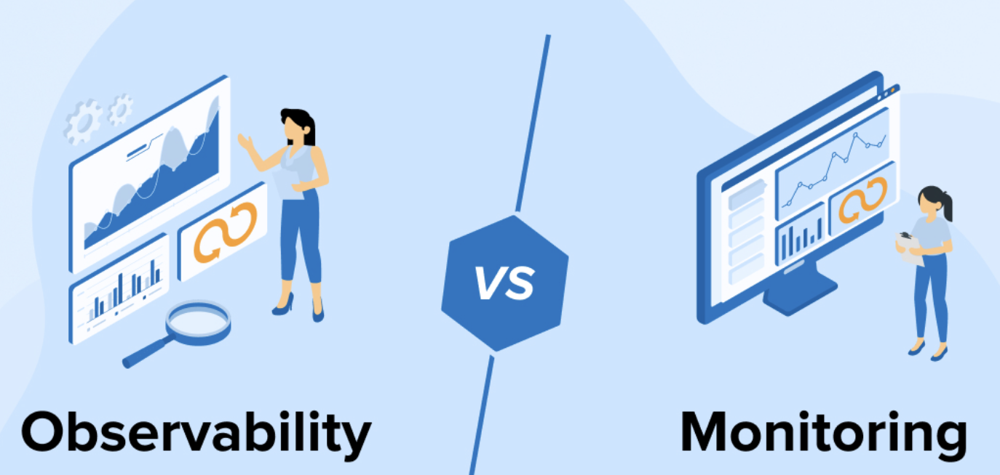
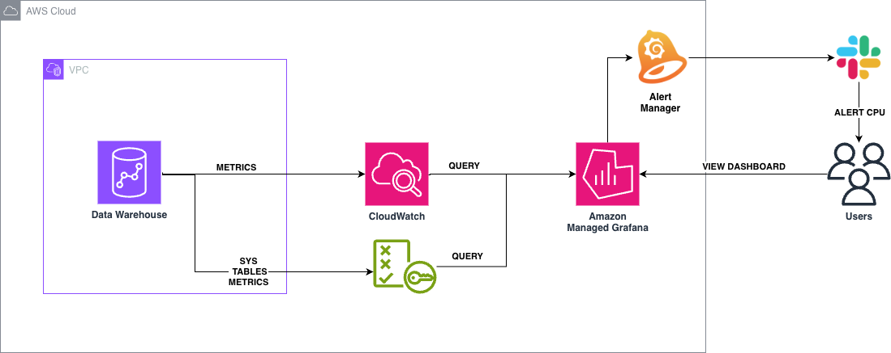
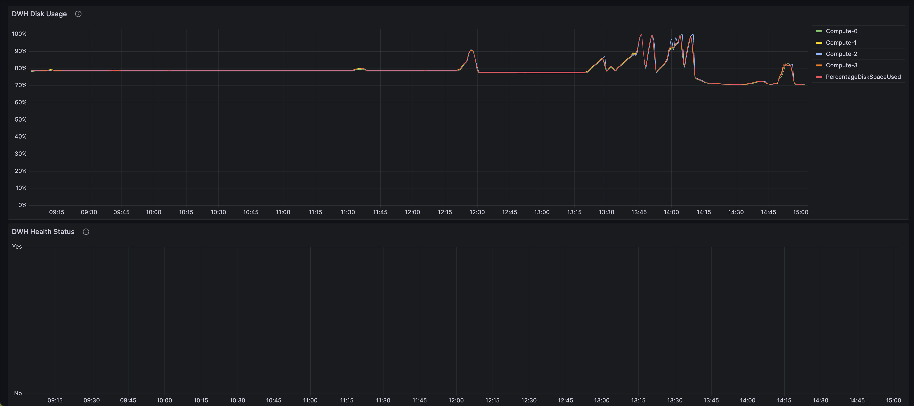
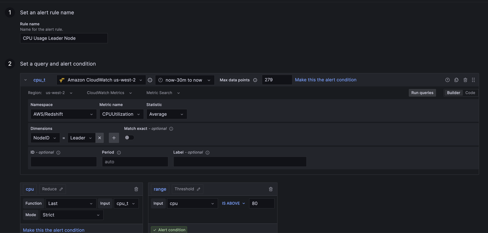
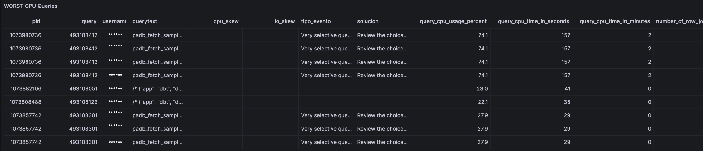
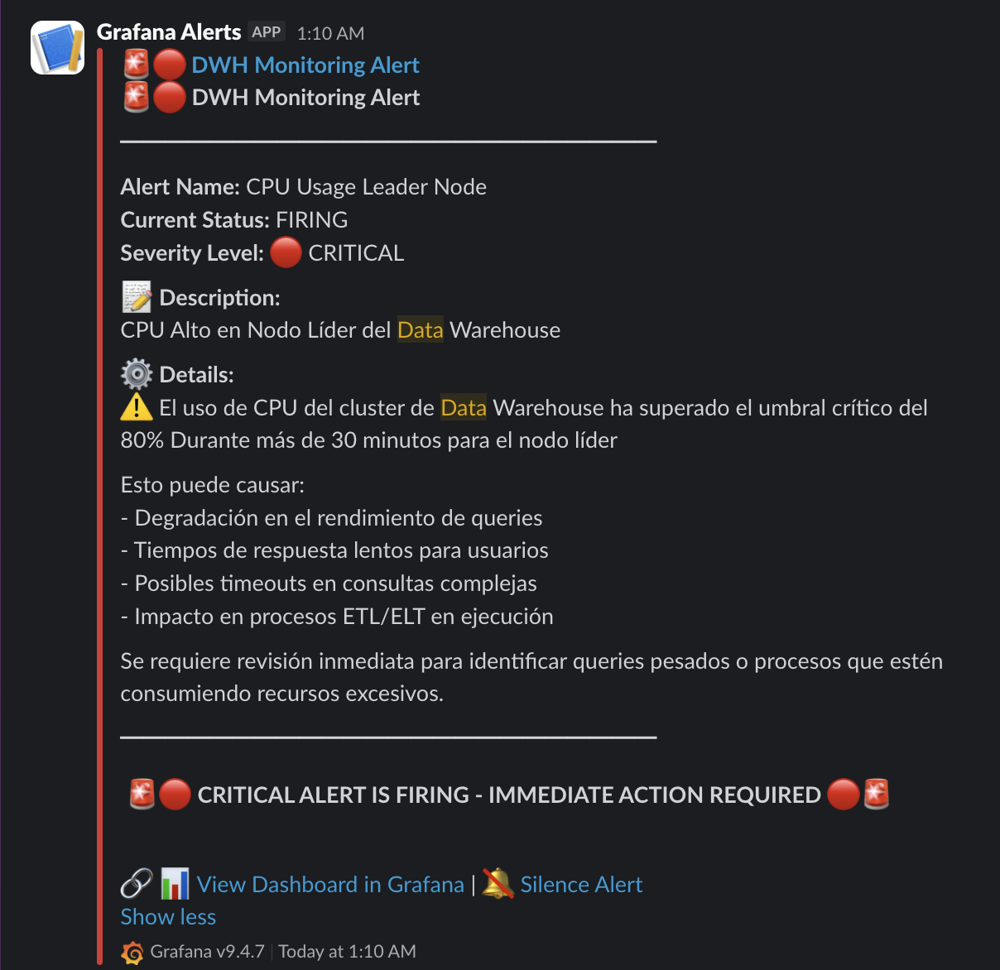

# Monitoreo de Amazon Redshift utilizando Grafana & Cloudwatch

> 🇬🇧 [Read this article in English](README.en.md)

Si alguna vez has estado en contacto con alguna base de datos o sistema, seguro te has tenido la necesidad de saber como se están comportando, y es que al igual que un auto entender los parámetros que afectan el comportamiento tales como el rendimiento, la velocidad o el rango, nos ayudan a saber si algo está mal o si tenemos recuross para poder llegar de punto a a punto B.

He recopilado algunas ideas de monitoreo usando herramientas como Amazon Managed Grafana y Cloudwatch con alertas por Slack, esperando que pueda contribuir y ayudar a los demás a tener algunas ideas de como monitorizar un Data warehouse:

En este artículo cubriremos:
- [Un data warehouse sin monitoreo](#un-data-warehouse-sin-monitoreo)
- [Monitoreo y observabilidad](#monitoreo-y-observabilidad)
- [Herramientas de monitoreo en AWS](#herramientas-de-monitoreo-en-aws)
- [CloudWatch con Grafana, donde el monitoreo brilla](#cloudwatch-y-grafana-donde-el-monitoreo-brilla)
- [Arquitectura de monitoreo de data warehouse con Grafana](#arquitectura-de-monitoreo-de-data-warehouse-con-grafana)
- [Monitoreo de CPU del cluster](#monitoreo-de-cpu-del-clúster)
- [Alertas de CPU usando Slack](#alertas-de-cpu-usando-slack)
- [Conclusiones](#conclusiones)

# Un data warehouse sin monitoreo
Los primeros indicios fueron casi imperceptibles: una carga que tardaba un poco más de lo normal, un DAG de dbt que se extendía algunos minutos extra. Pero con el crecimiento del negocio, esos minutos se convirtieron en horas, y las horas en un problema que ya no podía ignorarse. Las cargas al data warehouse comenzaron a dispararse, los queries se quedaban suspendidas indefinidamente y los tiempos de ejecución de los DAGs no dejaban de crecer. El requerimiento era claro: había que optimizar.

<p align="center">
  
</p>

Investigando en la documentación de AWS encontré distintas técnicas que prometían alivio "sort keys, distribution styles, compresiones" y la documentación de dbt ofrecía sus propias estrategias a través de distintas materializaciones. Sin embargo, una pregunta persistía: ¿sabemos dónde está realmente el problema? ¿Qué procesos eran los más ineficientes? ¿En qué horarios ocurrían? ¿Quiénes los ejecutaban?
Diagnosticar un clúster enfermo sin métricas es como intentar operar a un paciente con los ojos vendados: puedes tener la mejor técnica del mundo, pero si no sabes dónde duele, cualquier intervención es un disparo al aire. Era evidente que no teníamos visibilidad sobre las dolencias reales del clúster, y aplicar optimizaciones a ciegas solo nos conduciría a soluciones de bajo impacto, imposibles de medir y aún más difíciles de justificar.


# Monitoreo y observabilidad
De acuerdo con AWS, el monitoreo se define como "el proceso de recopilar datos y generar informes sobre diferentes métricas que definen el estado del sistema" (Amazon Web Services, s.f.). En términos prácticos, esto se traduce en tener un mecanismo de obtención y reporte de elementos clave, algo que en el mundo de los microservicios modernos resulta indispensable: cuando una aplicación está compuesta por múltiples servicios interdependientes, medir el comportamiento de cada uno de ellos es el primer paso para entender la salud del sistema en su conjunto.

La observabilidad, por otro lado, va un paso más allá. Mientras el monitoreo nos dice qué está ocurriendo, la observabilidad nos permite entender el por qué, es un enfoque investigativo que utiliza los datos recopilados para encontrar la causa raíz de los problemas (Amazon Web Services, s.f.). En arquitecturas de microservicios esto cobra especial relevancia, ya que una falla puede originarse en un servicio y manifestarse en otro completamente distinto.

<p align="center">
  
</p>


Llevando estos conceptos a nuestro caso, el monitoreo debía capturar las métricas clave que afectan el rendimiento del data warehouse; tiempos de ejecución de queries, uso de memoria, concurrencia de conexiones,  mientras que la observabilidad nos daría el marco analítico para interpretar esos datos y seleccionar las técnicas de optimización más adecuadas para cada situación.

# Herramientas de monitoreo en AWS
AWS ofrece un ecosistema robusto de herramientas de monitoreo, tanto nativas como gestionadas, que permiten tener visibilidad sobre el estado de los servicios en distintos niveles. A continuación, las más relevantes para una arquitectura de datos:

## CloudWatch
Es el servicio central de monitoreo y observabilidad de AWS. Recopila métricas, logs y eventos de los recursos de la cuenta en tiempo real, y permite configurar alarmas que pueden desencadenar acciones automáticas a través de EventBridge, funciones Lambda o notificaciones vía SNS (Amazon Web Services, s.f.-a; Bhatt, 2023).
## X-Ray
Es el servicio de rastreo distribuido de AWS. Recopila datos de los servicios que componen una aplicación y genera mapas de dependencias que permiten identificar cuellos de botella, errores y excepciones entre microservicios, lo que lo convierte en una herramienta especialmente valiosa para diagnosticar problemas que atraviesan múltiples componentes (Amazon Web Services, s.f.-b; Bhatt, 2023).
## CloudTrail
Proporciona una vista unificada de gobernanza, auditoría y cumplimiento normativo de todos los eventos y llamadas a la API realizadas dentro de una cuenta de AWS. Permite rastrear qué recursos fueron creados o eliminados, quién lo hizo y cuándo. Todos los registros son inmutables, lo que garantiza la integridad del historial de actividad.
## DataDog
Aunque no es un servicio propio de AWS, DataDog es una de las plataformas SaaS de observabilidad y seguridad más adoptadas en la industria. Permite construir dashboards interactivos que consolidan métricas, logs y trazas de todos los microservicios y sistemas de una organización en un solo lugar (Datadog, s.f.).

## Amazon Managed Grafana
Es el servicio completamente administrado de AWS basado en Grafana de código abierto. Permite consultar, correlacionar y visualizar métricas, logs y trazas provenientes de múltiples fuentes de datos, incluyendo CloudWatch, X-Ray y servicios de terceros, sin necesidad de gestionar la infraestructura subyacente. Admite la creación colaborativa de dashboards, alertas y control de acceso a nivel de equipo (Amazon Web Services, s.f.-c).

# CloudWatch y Grafana: donde el monitoreo brilla
Cada una de las herramientas anteriores resuelve un problema específico de visibilidad, pero en la práctica surge un desafío recurrente: los datos están dispersos. Al comenzar con el monitoreo del data warehouse, uno de los primeros obstáculos fue precisamente ese: necesitaba cruzar en un solo lugar las métricas de estado del clúster de Redshift CPU, latencia, conexiones activas, con datos internos como las queries en ejecución y las alertas propias de performance.

<p align="center">
  
</p>

La integración de Amazon Managed Grafana con CloudWatch como fuente de datos en conjunto de la conexión de Redshift como data source resolvió esto de manera elegante. Al conectar ambos servicios, fue posible unificar en un solo dashboard tanto las métricas expuestas por AWS como las tablas de sistema de Redshift, y además agregar una integración con Slack para recibir notificaciones en tiempo real ante cualquier anomalía de rendimiento. En los siguientes apartados veremos exactamente cómo se construyó esta arquitectura.

# Arquitectura de monitoreo de data warehouse con Grafana

La arquitectura se apoya en tres elementos esenciales que trabajan en conjunto: 
**Amazon Managed Grafana** como herramienta central de visualización y alertas, 
**Amazon CloudWatch** como fuente de métricas del clúster, y el **plugin nativo 
de Redshift para Grafana** para consultar directamente las tablas de sistema del 
data warehouse.

<p align="center">
  
</p>


## 1. Configuración de fuentes de datos en Grafana

El primer paso es conectar Grafana con sus dos fuentes de información. La primera 
es **CloudWatch**, que expone las métricas de infraestructura del clúster de 
Redshift como `CPUUtilization`, `ReadThroughput` o `DatabaseConnections` y que 
se agrega directamente como data source nativo dentro de Grafana 
(Grafana Labs, s.f.-a; Amazon Web Services, s.f.-d). 

La segunda fuente es **Redshift** en sí mismo, conectado mediante el plugin oficial 
`grafana-redshift-datasource`, que permite ejecutar queries SQL desde Grafana 
directamente contra las tablas de sistema del clúster. Para que esta conexión 
funcione, es necesario definir previamente un *access policy* en AWS con los 
permisos adecuados que autorice a Grafana a conectarse al clúster 
(Grafana Labs, s.f.-b).

## 2. Dashboards por temática

Con ambas fuentes conectadas, el siguiente paso es centralizar los datos en 
dashboards especializados por temática. Cada dashboard combina métricas de 
CloudWatch y consultas a tablas de sistema de Redshift para ofrecer una vista 
completa de un aspecto específico del clúster. En mi implementación se definieron 
los siguientes dashboards:

- **CPU Usage**: seguimiento del uso de CPU por nodo a lo largo del tiempo.
- **Query Monitoring**: queries activas, tiempos de ejecución y colas de espera.
- **Cluster Healthcheck**: estado general del clúster, conexiones y throughput.


<p align="center">
  
</p>

## 3. Alertas con Alertmanager y notificaciones en Slack

El último componente de la arquitectura es el sistema de alertas. Grafana incluye 
**Alertmanager**, que permite definir reglas de alerta basadas en cualquier métrica 
o query disponible en los data sources configurados.

Para conectar las alertas con Slack, primero se debe crear una aplicación de Grafana 
dentro del workspace de Slack y obtener el webhook correspondiente. Con esto se 
agrega un nuevo *contact point* en Grafana de tipo Slack (Grafana Labs, s.f.-c). 
Posteriormente se define una *notification policy* que filtra las alertas usando 
el label `dwh`, asegurando que solo las alertas del data warehouse lleguen a ese 
canal.

<p align="center">
  
</p>

Como ejemplo concreto, se configuró una alerta que se dispara cuando el uso de CPU 
del nodo líder supera el **80% durante más de 30 minutos**. Los parámetros clave 
de evaluación son:

- **Intervalo de evaluación**: cada 30 minutos.
- **Período de confirmación**: 10 minutos (la condición debe cumplirse durante ese 
  tiempo antes de disparar la alerta).
- **Data source**: CloudWatch con la métrica `CPUUtilization` del clúster.

Para personalizar el formato de los mensajes enviados a Slack, Grafana permite 
configurar plantillas en los *Optional Slack settings* del contact point. 
El título y el cuerpo del mensaje se definen con la sintaxis de Go templates, 
lo que permite incluir íconos dinámicos según la severidad de la alerta 
(`Critical`, `Warning`, `Info`), el nombre de la alerta, su estado actual, 
una descripción, detalles adicionales y un enlace directo al dashboard 
correspondiente en Grafana. Estos valores de descripción y detalles se 
completan en la sección **"Add details for your alert rule"** al momento de 
definir cada regla.

<p align="center">
  
</p>


## Monitoreo de CPU del clúster

El dashboard de CPU es probablemente el más crítico de toda la arquitectura; 
es el primero que hay que revisar cuando llega una alerta y el que más rápido 
permite tomar decisiones de acción. Se compone de tres elementos visuales 
complementarios entre sí.

El primero es una **gráfica de línea de tiempo** que muestra la métrica 
`CPUUtilization` de CloudWatch segmentada por nodo del clúster, lo que permite 
identificar no solo si el CPU está alto, sino *en qué nodo* se está concentrando 
la presión. El segundo son **indicadores** que muestran el estado más reciente de CPU 
por nodo, útiles para tener una lectura instantánea del momento actual sin tener 
que interpretar la gráfica histórica.

<p align="center">
  
</p>

El tercer elemento es una tabla de **queries activos en tiempo real**, construida 
sobre la tabla de sistema `STV_RECENTS` de Redshift, que registra las consultas 
en ejecución en el clúster en este momento (Amazon Web Services, s.f.-e). 
La consulta utilizada es la siguiente:

```sql
SELECT
    pid,
    db_name                          AS "database",
    status,
    duration / 60000000.0            AS "query_duration_minutes",
    user_name,
    query,
    starttime
FROM stv_recents
WHERE status = 'Running';
```

Esta tabla es la pieza que convierte el dashboard de CPU en una herramienta 
de diagnóstico accionable: al cruzar el estado de CPU por nodo con los queries 
que están ejecutando en ese momento, es posible identificar qué procesos están 
agotando los recursos, qué usuarios o aplicaciones los están generando y cuánto 
tiempo llevan corriendo. Con esa información, la acción correctiva puede ser 
tan inmediata como cancelar una consulta pesada que lleva horas saturando el 
nodo líder, o tan estratégica como priorizar ese proceso para una ronda de 
optimización.

### Worst CPU Queries

Más allá del estado en tiempo real, es igual de valioso entender cuáles han 
sido históricamente los queries más costosos en términos de CPU. Para esto se 
construyó el panel **Worst CPU Queries**, que cruza tres tablas de sistema de 
Redshift:

- `STL_QUERY`: registro histórico de todas los queries ejecutados en el clúster 
  (Amazon Web Services, s.f.-f).
- `SVL_QUERY_METRICS`: vista que expone métricas de rendimiento de queries 
  completadas, incluyendo `cpu_time`, `cpu_skew`, `io_skew` y conteos de filas 
  procesadas (Amazon Web Services, s.f.-g).
- `STL_ALERT_EVENT_LOG`: tabla que registra las alertas de rendimiento que 
  Redshift levanta internamente para un query, incluyendo el tipo de evento 
  y la sugerencia de solución correspondiente (Amazon Web Services, s.f.-h).

<p align="center">
  
</p>

La combinación de estas tres fuentes es particularmente poderosa: no solo muestra 
cuánto CPU consumió un query, sino que incluye directamente la recomendación de 
Redshift para solucionar el problema de rendimiento detectado. La consulta 
utilizada es:

```sql
SELECT 
    stq.pid,
    stq.query,
    u.usename                                   AS "username",
    LEFT(stq.querytxt, 500)                     AS "querytext",
    svq.cpu_skew,
    svq.io_skew,
    TRIM(SPLIT_PART(event, ':', 1))             AS "redshift_alert",
    TRIM(solution)                              AS "redshift_solution",
    svq.query_cpu_usage_percent,
    svq.query_cpu_time                          AS "query_cpu_time_seconds",
    svq.query_cpu_time / 60                     AS "query_cpu_time_minutes",
    svq.join_row_count                          AS "rows_joined",
    svq.scan_row_count,
    svq.query_execution_time,
    stq.starttime,
    stq.endtime
FROM stl_query stq
JOIN svl_query_metrics svq 
    ON stq.query = svq.query 
LEFT JOIN stl_alert_event_log ael 
    ON ael.query = stq.query
LEFT JOIN pg_user u 
    ON stq.userid = u.usesysid
WHERE svq.query_cpu_time IS NOT NULL 
  AND $__timeFilter(stq.starttime) 
ORDER BY svq.query_cpu_time DESC 
LIMIT 20;
```

## Alertas de CPU usando Slack

Con el dashboard de CPU construido, el sistema de alertas cierra el ciclo: en 
lugar de tener que revisar Grafana manualmente de forma periódica, la alerta 
actúa como un centinela que notifica el momento exacto en que el 
clúster está bajo presión.

La regla definida evalúa la métrica `CPUUtilization` de CloudWatch en el nodo 
líder cada 30 minutos, y se dispara si el valor supera el **80% durante un 
período de confirmación de 10 minutos**, esto evita falsos positivos por 
picos momentáneos. Cuando la condición se cumple, Grafana envía una notificación 
al canal de Slack correspondiente con el nivel de severidad, la descripción del 
problema y un enlace directo al dashboard de CPU para iniciar el diagnóstico.

<p align="center">
  
</p>

La respuesta ante una alerta puede seguir dos caminos dependiendo de lo que 
revele el dashboard: si hay un query que lleva horas en ejecución y está 
saturando el nodo líder, la acción más inmediata es cancelarlo. Si el problema 
es recurrente y está asociado a un proceso propio, como un modelo de dbt con 
una materialización ineficiente o una consulta sin sort key adecuado, la alerta 
se convierte en el punto de partida para una labor de optimización fundamentada 
en datos reales.

## Conclusiones

Implementar esta arquitectura de monitoreo fue, en muchos sentidos, como encender 
las luces en una habitación que llevaba tiempo a oscuras. Los problemas no eran 
nuevos, los queries lentos, los DAGs que tardaban cada vez más, el clúster que 
respondía con fatiga todo esto ocurriendo sin métricas, sin visibilidad, sin un lugar donde 
mirar, cualquier intento de solución era poco más que una apuesta.

Lo que cambió con el monitoreo no fue el clúster en sí, sino la capacidad 
de entenderlo. Se identificaron queries de testing de dbt que consumían recursos 
en producción sin que nadie lo supiera. Se descubrieron usuarios cuyas consultas 
llevaban horas ejecutándose y saturaban el nodo líder. Se encontraron patrones 
recurrentes que, ahora visibles, se convirtieron en candidatos concretos para 
optimización.

El monitoreo de un data warehouse es uno de esos temas que se posterga 
indefinidamente "siempre hay una feature más urgente, un pipeline más prioritario" 
hasta que el sistema colapsa y la urgencia se impone. Sin embargo 
invertir en visibilidad antes de que surja el problema es exactamente lo que 
permite que el sistema escale con el negocio en lugar de convertirse en un 
cuello de botella.

Si hay algo que esta experiencia me dejó claro, es que un data warehouse sin 
monitoreo no es un sistema que funciona bien: es un sistema que aún no ha 
fallado lo suficiente como para que nos demos cuenta de que no lo entendemos.

# Referencias
- Amazon Web Services. (s.f.). The difference between monitoring and observability. AWS. https://aws.amazon.com/es/compare/the-difference-between-monitoring-and-observability/
- Amazon Web Services. (s.f.-a). Amazon CloudWatch. AWS. https://aws.amazon.com/es/cloudwatch/
- Amazon Web Services. (s.f.-b). AWS X-Ray. AWS. https://aws.amazon.com/es/xray/
- Amazon Web Services. (s.f.-c). Amazon Managed Grafana. AWS. https://aws.amazon.com/grafana/
- Bhatt, S. (2023). AWS Certified Data Engineer – Associate [Curso en línea]. Udemy. https://www.udemy.com/course/
aws-data-engineer-associate/
- Datadog. (s.f.). The monitoring and security platform for cloud applications. https://www.datadoghq.com/
- Amazon Web Services. (s.f.-d). *Viewing cluster performance data — Amazon Redshift*.  
https://docs.aws.amazon.com/redshift/latest/mgmt/performance-metrics-perf.html
- Grafana Labs. (s.f.-a). *Amazon CloudWatch data source*.  
https://grafana.com/docs/grafana/latest/datasources/aws-cloudwatch/
- Grafana Labs. (s.f.-b). *Redshift data source plugin*.  
https://grafana.com/docs/plugins/grafana-redshift-datasource/latest/
- Grafana Labs. (s.f.-c). *Configure Slack contact point*.  
https://grafana.com/docs/grafana/latest/alerting/configure-notifications/manage-contact-points/integrations/configure-slack/
- Amazon Web Services. (s.f.-e). *STV_RECENTS — Amazon Redshift*.  
https://docs.aws.amazon.com/es_es/redshift/latest/dg/r_STV_RECENTS.html
- Amazon Web Services. (s.f.-f). *STL_QUERY — Amazon Redshift*.  
https://docs.aws.amazon.com/redshift/latest/dg/r_STL_QUERY.html
- Amazon Web Services. (s.f.-g). *SVL_QUERY_METRICS — Amazon Redshift*.  
https://docs.aws.amazon.com/redshift/latest/dg/r_SVL_QUERY_METRICS.html
- Amazon Web Services. (s.f.-h). *STL_ALERT_EVENT_LOG — Amazon Redshift*.  
https://docs.aws.amazon.com/redshift/latest/dg/r_STL_ALERT_EVENT_LOG.html